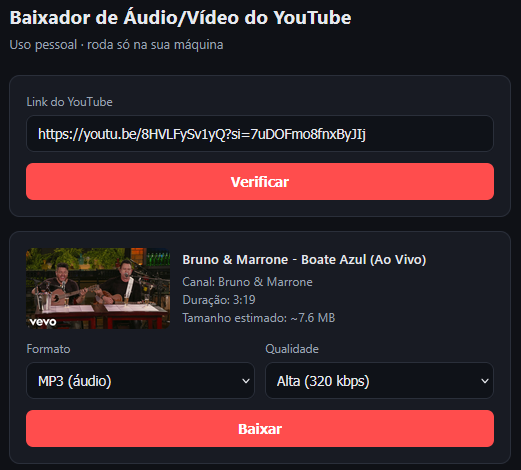

# ⬇️ YouTube Downloader

Ferramenta pessoal para baixar áudio (MP3) ou vídeo (MP4) do YouTube, com interface web simples: cole o link, veja a capa/título/duração/tamanho estimado, escolha o formato e baixe.

Feita para uso próprio/familiar, em baixo volume — **não é um serviço público**.



## ⚠️ Aviso importante

Baixar conteúdo do YouTube fora do player oficial contraria os Termos de Serviço da plataforma. Este projeto é para uso pessoal e educacional, com poucas requisições, idealmente para conteúdo próprio ou com licença aberta. Use por sua conta e risco.

Além disso: **IPs de servidores em nuvem (AWS, Render, Railway, etc.) são bloqueados pelo YouTube.** Este projeto só funciona bem rodando localmente, em uma rede residencial normal.

## Requisitos

- [Docker Desktop](https://www.docker.com/products/docker-desktop/) instalado (Windows/Mac/Linux)
- Conexão de internet residencial

## Como usar

**1. Clonar o repositório**
```bash
git clone https://github.com/Vinicius-Ferrarini/youtubeDownloader.git
cd youtubeDownloader
```

**2. Subir o app**
```bash
docker compose up --build
```

**3. Acessar no navegador**
```
http://localhost:8000
```

Cole o link do vídeo, clique em "Verificar", confira as informações, escolha MP3 ou MP4 e clique em baixar.

Os arquivos ficam salvos em `./downloads` na sua máquina (fora do container), mesmo depois de parar o app.

**4. Parar o app**
```bash
docker compose down
```

## Estrutura do projeto

```
youtubeDownloader/
├── main.py              # API FastAPI (endpoints /info e /download)
├── downloader.py        # Lógica de download/conversão (yt-dlp + ffmpeg)
├── static/index.html    # Frontend (HTML + JS puro)
├── requirements.txt     # Dependências Python
├── Dockerfile
├── docker-compose.yml
├── .dockerignore
├── USAGE.md             # Guia de uso sem Docker (Python + ffmpeg local)
└── downloads/           # Arquivos baixados (não versionado no git)
```

Para rodar sem Docker (Python e ffmpeg instalados na máquina), veja [`USAGE.md`](USAGE.md).

## Acesso remoto (opcional)

Para acessar de outro dispositivo (ex: celular), use um túnel Cloudflare temporário:

```bash
cloudflared tunnel --url http://localhost:8000
```

Isso gera um link público temporário do tipo `https://algo.trycloudflare.com`. Para um link fixo, é necessário domínio próprio + Cloudflare Tunnel permanente (ver [documentação oficial](https://developers.cloudflare.com/cloudflare-one/connections/connect-networks/)).

Como o link fica público, considere adicionar uma trava simples (ex: Cloudflare Access) se for deixá-lo ativo por mais tempo.

## Manutenção

O YouTube muda sua estrutura de página com frequência, o que pode quebrar downloads temporariamente. Se algo parar de funcionar do nada, reconstrua a imagem para pegar a versão mais recente do `yt-dlp`:

```bash
docker compose build --no-cache
docker compose up
```

## Licença

Uso pessoal, sem garantias. Não redistribua nem hospede publicamente.
